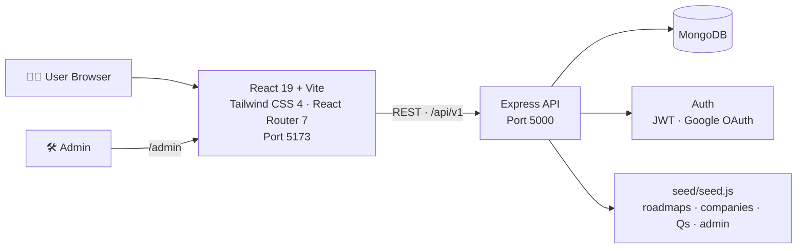

<div align="center">


# 🚀 MOYU — Career Prep Platform

**Your all-in-one launchpad for landing the job you want.**

Roadmaps · Practice Questions · Coding Challenges · Assessments · Company Guides · Resume Tools

<br>

<p>
  
  
  
  
</p>

<p>
  
  
  
  
  
  
  
</p>

<br>

<a href="#-quick-start"></a>&nbsp;
<a href="#-api-overview-apiv1"></a>&nbsp;
<a href="#-log-in"></a>

</div>

<br>

> A full-stack **MERN** career-preparation platform — one place for roadmaps, practice, coding challenges, assessments, company guides, resources, resume tools, projects, and notifications, plus a full admin panel.

<br>

## 📑 Table of Contents

- [✨ Highlights](#-highlights)
- [🧩 Architecture](#-architecture)
- [⚡ Quick Start](#-quick-start)
- [🔐 Logging In](#-log-in)
- [📂 Project Structure](#-project-structure)
- [🌐 API Overview](#-api-overview-apiv1)
- [🔑 Environment Variables](#-environment-variables)
- [🧰 Scripts](#-scripts)
- [🗺️ Roadmap](#️-roadmap)
- [🤝 Contributing](#-contributing)
- [📝 Notes](#-notes)

<br>

## ✨ Highlights

<table>
<tr>
<td width="33%" valign="top">

### 🗺️ Guided Roadmaps
Curated, step-by-step learning paths so you always know what to study next — no more guesswork.

</td>
<td width="33%" valign="top">

### 💻 Coding Lab
Real judged problems across Easy · Medium · Hard tiers, with instant feedback and optimal solutions.

</td>
<td width="33%" valign="top">

### 🏢 Company Guides
Deep dives into hiring patterns, interview rounds, and prep tips for top companies.

</td>
</tr>
<tr>
<td width="33%" valign="top">

### 📝 Assessments
Timed quizzes and mock tests that mirror real screening rounds.

</td>
<td width="33%" valign="top">

### 📄 Resume Tools
Build, refine, and export a recruiter-ready resume in minutes.

</td>
<td width="33%" valign="top">

### 🛠️ Admin Panel
Full control over content, users, and live platform activity.

</td>
</tr>
</table>

<br>

## 🧩 Architecture



<details>
<summary><b>📦 Module map — what lives behind each API prefix</b></summary>

<br>

| Module | Powers |
|---|---|
| `auth` | Register/login, Google OAuth, password reset |
| `roadmaps` | Guided learning paths |
| `practice` | Practice questions |
| `coding` | Coding problems + runner |
| `assessments` | Quizzes / assessments |
| `companies` | Company guides |
| `resources` | Curated resources |
| `resume` | Resume builder |
| `projects` | Project ideas |
| `dashboard` | Per-user dashboard |
| `notifications` | User notifications |
| `admin` | Admin-only management |
| `theme` | Theme preferences |

</details>

<br>

## ⚡ Quick Start

<details open>
<summary><b>1️⃣ Backend</b></summary>

```bash
cd backend
npm install
cp .env.example .env   # then fill in MONGO_URI, JWT_SECRET, etc.
node seed/seed.js      # seeds roadmaps, companies, practice Qs, assessments + admin user
node server.js         # runs on http://localhost:5000
```

**Health check:** `GET http://localhost:5000/api/health` → `{ "status": "OK" }`

</details>

<details open>
<summary><b>2️⃣ Frontend</b></summary>

```bash
cd frontend
npm install
cp .env.example .env   # VITE_API_URL defaults to http://localhost:5000/api/v1
npm run dev            # runs on http://localhost:5173
```

</details>

<div align="center">

**🎉 That's it —** open **http://localhost:5173** and you're in.

</div>

<br>

## 🔐 Log In

| Role | How |
|---|---|
| 🎓 **Student** | Register at `/register` |
| 🛡️ **Admin** | Use `SEED_ADMIN_EMAIL` / `SEED_ADMIN_PASSWORD` from `backend/.env` (defaults: `admin@moyu.dev` / `MoyuAdmin@123`) → opens `/admin` |

<br>

## 📂 Project Structure

```
MOYU/
├── backend/            # Express API (config, controllers, middleware, models, routes, seed, utils)
│   ├── server.js       # app entry, mounts /api/v1/* routes
│   ├── .env.example    # safe template (real .env is git-ignored)
│   └── seed/seed.js    # database seeder
├── frontend/           # Vite + React app
│   ├── src/            # pages, components, layouts, context, services, hooks
│   ├── .env.example    # safe template
│   └── vite.config.js
├── .gitignore          # ignores node_modules, .env, dist, logs, root *.txt scratch dumps
└── README.md
```

<br>

## 🌐 API Overview (`/api/v1`)

<div align="center">

| Prefix | Area |
|---|---|
| `/auth` | Register/login, Google OAuth, password reset |
| `/dashboard` | User dashboard |
| `/assessments` | Quizzes/assessments |
| `/roadmaps` | Learning roadmaps |
| `/practice` | Practice questions |
| `/companies` | Company guides |
| `/resources` | Curated resources |
| `/resume` | Resume builder |
| `/projects` | Project ideas |
| `/coding` | Coding problems + runner |
| `/notifications` | User notifications |
| `/admin` | Admin-only management |
| `/theme` | Theme preferences |

</div>

<br>

## 🔑 Environment Variables

<table>
<tr>
<td valign="top" width="50%">

**Backend** — `backend/.env`

```env
PORT=
MONGO_URI=
JWT_SECRET=
CLIENT_ORIGIN=
GOOGLE_CLIENT_ID=
SEED_ADMIN_EMAIL=
SEED_ADMIN_PASSWORD=
```

</td>
<td valign="top" width="50%">

**Frontend** — `frontend/.env`

```env
VITE_API_URL=
VITE_GOOGLE_CLIENT_ID=
```

</td>
</tr>
</table>

See each side's `.env.example` for a safe template.

> ⚠️ **Never commit real `.env` files.** Rotate any secret that was ever pasted into chat, logs, or a zip before pushing.

<br>

## 🧰 Scripts

<div align="center">

| Where | Command | Does |
|:---:|---|---|
| 🖥️ Backend | `npm run dev` | Start with nodemon |
| 🖥️ Backend | `npm start` | Start production server |
| 🖥️ Backend | `npm run seed` | Run database seeder |
| 🎨 Frontend | `npm run dev` | Start Vite dev server |
| 🎨 Frontend | `npm run build` | Production build |
| 🎨 Frontend | `npm run preview` | Preview production build |
| 🎨 Frontend | `npm run lint` | Run linter |

</div>

<br>

## 🗺️ Roadmap

- [x] Core roadmaps, practice, and coding modules
- [x] Google OAuth + password reset
- [x] Admin panel with live activity
- [ ] Peer discussion threads on coding problems
- [ ] Mobile app companion
- [ ] AI-powered mock interviews

<br>

## 🤝 Contributing

Contributions, issues, and feature requests are welcome!

1. Fork the repo and create your branch: `git checkout -b feature/amazing-thing`
2. Commit your changes: `git commit -m "Add amazing thing"`
3. Push and open a PR

<br>

## 📝 Notes

- `node_modules/`, `dist/`, `*.log`, and the ~96 scratch `*.txt` / lint dumps at the old workspace root are intentionally **not committed** (see `.gitignore`). They remain on your local disk.

<div align="center">

---

**Built with 🧠 MERN** — Mongo · Express · React · Node

<sub>If MOYU helped your prep, consider ⭐ starring the repo!</sub>

</div>
